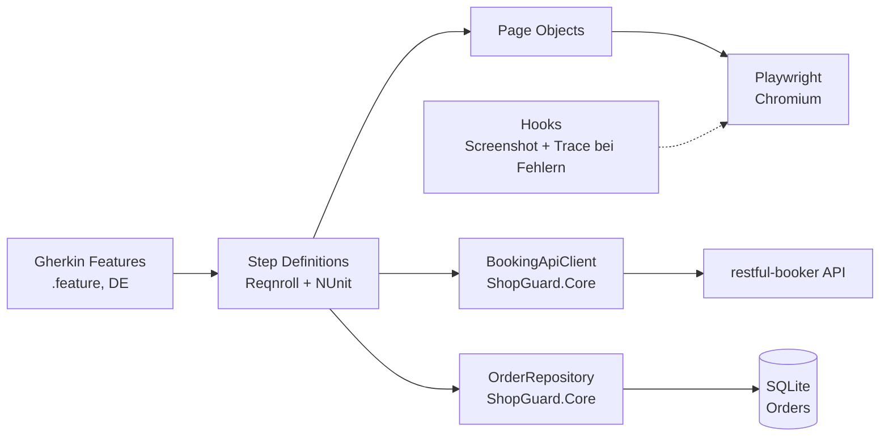
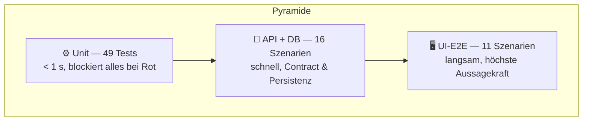

<p align="center">
  
</p>

<p align="center">
  <a href="https://gitlab.com/REPLACE_NAMESPACE/shopguard/-/pipelines"></a>
  <a href="https://gitlab.com/REPLACE_NAMESPACE/shopguard/-/pipelines"></a>
  
  
  
  <a href="LICENSE"></a>
</p>

<p align="center">
  
  <br><em>E2E-Lauf in Aktion: Login → Produktsuche → Warenkorb → Checkout mit Bestellbestätigung</em>
</p>

**ShopGuard** ist ein BDD-Test-Automation-Framework für einen Demo-Webshop und eine REST API.
Es kombiniert Gherkin-Szenarien (Reqnroll) mit Playwright-UI-Tests, typisierten API-Tests und SQL-Datenbank-Validierung.
Eine GitLab-Pipeline führt Unit-, Smoke-, Feature- und Regression-Suiten tag-basiert und fail-fast aus.

---

## 📑 Inhaltsverzeichnis

- [Features](#-features)
- [Architektur](#-architektur)
- [Screenshots](#-screenshots)
- [Quick Start](#-quick-start)
- [Teststrategie](#-teststrategie)
- [Ordnerstruktur](#-ordnerstruktur)
- [CI/CD-Pipeline](#-cicd-pipeline)
- [Defect-Management](#-defect-management)
- [Bonus: Playwright mit TypeScript](#-bonus-playwright-mit-typescript)

---

## ✨ Features

| Feature | Status | Technologie |
|---|---|---|
| ✅ UI-E2E-Tests (11 Szenarien) | grün | Playwright für .NET, Page Object Model |
| ✅ API-Tests (14 Szenarien) | grün | Typisierter `HttpClient`-Client gegen restful-booker |
| ✅ Unit-Tests (49 Tests, < 1 s) | grün | NUnit 4 + Moq, gemockter `HttpMessageHandler` |
| ✅ SQL-Validierung (2 Szenarien) | grün | SQLite + Dapper, ANSI-kompatibles Schema |
| ✅ Code Coverage ≥ 80 % | 99,6 % | Coverlet + ReportGenerator |
| ✅ CI/CD mit Tag-Selektion | bereit | GitLab CI, 6 Stages, Fail-Fast-Testpyramide |
| ✅ Screenshots + Traces bei Fehlern | aktiv | Playwright Tracing, CI-Artefakte |

**Testziele:** UI gegen den [Toolshop](https://practicesoftwaretesting.com) (automatisierungsfreundlich, stabile `data-test`-Attribute), API gegen [restful-booker](https://restful-booker.herokuapp.com).
*Hinweis: Ursprünglich war demo.nopcommerce.com vorgesehen — die Seite blockiert Automatisierung inzwischen per Cloudflare-Challenge (auch headed). Details im Architektur-Abschnitt.*

---

## 🏗 Architektur



Wiederverwendbare Logik (API-Client, Preisberechnung, Testdaten-Generator, Config-Loader, Order-Repository)
liegt in `ShopGuard.Core` und ist vollständig unit-getestet — die E2E-Schicht bleibt dünn.

---

## 📸 Screenshots

> Die Screenshots entstehen beim ersten Pipeline-Lauf; Dateinamen sind vorbereitet.


<br><em>Grüne Pipeline mit allen Stages (build → unit → smoke → feature → regression → report)</em>


<br><em>Coverage-Report: 99,6 % Line Coverage für ShopGuard.Core</em>


<br><em>Playwright-Trace-Viewer bei einem fehlgeschlagenen Checkout (DEFECT-003)</em>


<br><em>JUnit-Testreport in GitLab: 27 E2E-Szenarien</em>


<br><em>Defect Report nach Jira-Template (DEFECT-001: API antwortet 418)</em>

---

## 🚀 Quick Start

1. **Repository klonen und bauen**
   ```bash
   git clone <repo-url> && cd Qa_Automation
   dotnet build ShopGuard
   ```
2. **Playwright-Browser installieren** (einmalig)
   ```bash
   dotnet tool install --global Microsoft.Playwright.CLI
   playwright install chromium
   ```
3. **Unit-Tests ausführen** (< 1 Sekunde)
   ```bash
   dotnet test ShopGuard/ShopGuard.UnitTests
   ```
4. **Smoke-Suite ausführen** (UI + API, ~1 Minute)
   ```bash
   dotnet test ShopGuard/ShopGuard.E2ETests --filter "TestCategory=smoke"
   ```
5. **Headed zusehen** (Browser sichtbar)
   ```bash
   HEADLESS=false dotnet test ShopGuard/ShopGuard.E2ETests --filter "TestCategory=ui"
   ```

Umgebung wechseln: `SHOPGUARD_ENV=staging` (Overrides in [appsettings.test.json](ShopGuard/ShopGuard.E2ETests/appsettings.test.json)).

---

## 🎯 Teststrategie



**Tagging-Konzept** (Reqnroll-Tags → NUnit-Kategorien → `--filter "TestCategory=..."`):

| Tag | Bedeutung | Läuft in Stage |
|---|---|---|
| `@smoke` | kritischer Pfad, max. 5 min | `smoke` (jeder Push) |
| `@ui` / `@api` / `@db` | Schicht-Auswahl | `feature` (Merge Requests) |
| `@regression` | kompletter Testsatz | `regression` (nightly Schedule) |
| `@e2e` | kompletter Bestellfluss | `feature` + `regression` |
| `@wip` | in Arbeit / instabil ([FLAKY-TESTS.md](FLAKY-TESTS.md)) | nirgends |

---

## 📁 Ordnerstruktur

```
Qa_Automation/
├── ShopGuard/
│   ├── ShopGuard.Core/          # Wiederverwendbar: ApiClient, Helper, Models, OrderRepository
│   ├── ShopGuard.UnitTests/     # 49 NUnit-Tests, Moq-gemockter HttpMessageHandler
│   └── ShopGuard.E2ETests/
│       ├── Features/
│       │   ├── UI/              # Login, Warenkorb, Suche, Checkout (Gherkin, DE)
│       │   └── API/             # Buchungs-CRUD, Auth, Negativtests, DB-Validierung
│       ├── StepDefinitions/     # Bindings, dünn — Logik liegt in Pages/Core
│       ├── Pages/               # Page Object Model (data-test-Selektoren)
│       ├── Database/            # SQL-Schema + scenario-scoped DB-Kontext
│       ├── Hooks/               # Browser-Lifecycle, Screenshot + Trace bei Fehlern
│       ├── Support/             # Settings, PlaywrightDriver, ScenarioState
│       └── reqnroll.json
├── playwright-ts/               # Bonus: 3 UI-Szenarien in Playwright Test (TypeScript)
├── docs/
│   ├── defects/                 # 3 Defect Reports nach Jira-Template
│   ├── JIRA-BUG-TEMPLATE.md
│   └── images/
├── FLAKY-TESTS.md               # Erkennung & Behandlung instabiler Tests
└── .gitlab-ci.yml               # 6 Stages, tag-basierte Selektion, Artefakt-Upload
```

---

## 🔁 CI/CD-Pipeline

<details>
<summary><b>Stages & Trigger im Überblick</b> (Klick zum Aufklappen)</summary>

| Stage | Trigger | Inhalt | Besonderheit |
|---|---|---|---|
| `build` | jeder Push | `dotnet build -c Release` | NuGet-Cache |
| `unit` | jeder Push | 49 Unit-Tests + Coverage | **Fail Fast** — rot ⇒ kein Browserstart |
| `smoke` | jeder Push | `--filter TestCategory=smoke` | `timeout: 5 minutes`, Retry 2× |
| `feature` | Merge Request | alle `@ui`/`@api`/`@db`-Szenarien | Screenshots/Traces als Artefakte |
| `regression` | nightly Schedule | kompletter Testsatz | inkl. Unit + E2E |
| `report` | Default-Branch / nightly | Coverage-HTML → GitLab Pages | Cobertura-Report im MR-Diff |

Komplette Konfiguration: [.gitlab-ci.yml](.gitlab-ci.yml)

</details>

Bei fehlgeschlagenen UI-Szenarien landen **Full-Page-Screenshot** und **Playwright-Trace**
automatisch als CI-Artefakte (`artifacts/<Szenario>.png` / `.trace.zip`) — Analyse mit:

```bash
playwright show-trace artifacts/<Szenario>.trace.zip
```

---

## 🐞 Defect-Management

Drei real gefundene und dokumentierte Defects (Template: [JIRA-BUG-TEMPLATE.md](docs/JIRA-BUG-TEMPLATE.md)):

| ID | Komponente | Kurzbeschreibung | Root Cause |
|---|---|---|---|
| [DEFECT-001](docs/defects/DEFECT-001.md) | API | `POST /booking` antwortet **418** statt 4xx ohne Accept-Header | Produktfehler |
| [DEFECT-002](docs/defects/DEFECT-002.md) | API | `POST /auth` liefert **200** bei falschen Credentials | Produktfehler |
| [DEFECT-003](docs/defects/DEFECT-003.md) | UI | Checkout blockiert: Hausnummer aus Registrierung fehlt im Profil | Produktfehler |

Workflow: Fehleranalyse (Trace/Logs) → Klassifikation (Produkt-/Testfehler/flaky) → Report → Workaround mit Verweis → Retest.

---

## 🎁 Bonus: Playwright mit TypeScript

Drei UI-Szenarien sind zusätzlich in **Playwright Test (TypeScript)** portiert — gleiche
Page-Object-Struktur, gleiche `data-test`-Selektoren:

```bash
cd playwright-ts
npm install && npx playwright install chromium
npx playwright test
```
